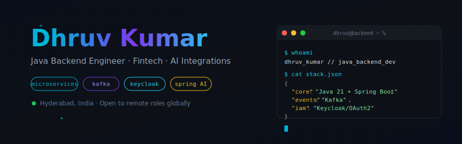

<!-- ============================================================
   DHRUV KUMAR · GitHub Profile README
   Custom-built · maximalist · recruiter-optimized
   ============================================================ -->

<!-- 🌊 CUSTOM HERO BANNER (animated SVG — terminal aesthetic) -->
<p align="center">
  
</p>

<!-- 💬 TYPING INTRO -->
<p align="center">
  <a href="https://github.com/Dhruvjava">
    
  </a>
</p>

<!-- 📊 LIVE BADGES -->
<p align="center">
  
  <a href="https://github.com/Dhruvjava?tab=followers">
    
  </a>
  
  
</p>

<br/>

<!-- ============================================================
     📌 QUICK NAV
     ============================================================ -->
<p align="center">
  <a href="#-about-me">About</a> &nbsp;·&nbsp;
  <a href="#-career-impact-dashboard">Impact</a> &nbsp;·&nbsp;
  <a href="#-tech-arsenal">Stack</a> &nbsp;·&nbsp;
  <a href="#-experience">Experience</a> &nbsp;·&nbsp;
  <a href="#-featured-projects">Projects</a> &nbsp;·&nbsp;
  <a href="#-github-analytics">Analytics</a> &nbsp;·&nbsp;
  <a href="#-currently-vibing-to">Now Playing</a> &nbsp;·&nbsp;
  <a href="#-lets-connect">Contact</a>
</p>

<br/>

<!-- ============================================================
     🧑‍💻 ABOUT ME
     ============================================================ -->
## <picture><source media="(prefers-color-scheme: dark)" srcset="https://github.githubassets.com/images/icons/emoji/unicode/1f44b.png?v8"/></picture> &nbsp;About Me

<table border="0">
<tr>
<td width="60%" valign="top">

```typescript
const dhruv = {
  role:       "Java Backend Engineer",
  current:    "OMISE  (via TAD International, 🇹🇭)",
  experience: "3.5+ years",
  location:   "Hyderabad, India 🇮🇳",

  obsessed_with: [
    "Distributed systems & event-driven design",
    "Securing fintech with OAuth2 / Keycloak",
    "Making slow APIs fast (Redis, query plans)",
    "Bringing GenAI into JVM workflows"
  ],

  shipping_now: "Decoupled payment-gateway microservices",
  learning:     ["Spring AI", "Multimodal LLMs"],

  philosophy:   "Build it boring, secure it hard, ship it fast."
};
```

</td>
<td width="40%" valign="top" align="center">


<br/><br/>

<a href="mailto:dhruv.rbs.java@gmail.com">
  
</a>
<a href="https://www.linkedin.com/in/dhruv-kumar-rbs/">
  
</a>

<br/>

<sub><i>⚡ Avg. response time: &lt; 24 hrs</i></sub>

</td>
</tr>
</table>

<br/>

<!-- ============================================================
     📊 CAREER IMPACT DASHBOARD (custom SVG)
     ============================================================ -->
## 📊 &nbsp;Career Impact Dashboard

<p align="center">
  
</p>

<br/>

<!-- ============================================================
     ⚡ TECH ARSENAL
     ============================================================ -->
## ⚡ &nbsp;Tech Arsenal

<table>
<tr>
<td align="center" width="33%">

#### 🎯 Backend Core

<br/>
<sub>Java 17/21 · Spring Boot · Spring Cloud<br/>Spring Security · JPA · Hibernate</sub>

</td>
<td align="center" width="33%">

#### 🔥 Data & Events

<br/>
<sub>Apache Kafka · PostgreSQL · MongoDB<br/>Redis · MySQL · SSE</sub>

</td>
<td align="center" width="33%">

#### ☁️ Cloud & DevOps

<br/>
<sub>AWS · Docker · Kubernetes<br/>Jenkins · Terraform · Linux</sub>

</td>
</tr>
<tr>
<td align="center">

#### 🔐 Security & IAM
<br/>


<br/>
<sub>Keycloak · OAuth2 · OIDC · JWT · RBAC · PCI-DSS</sub>

</td>
<td align="center">

#### 🤖 AI / ML
<br/>


<br/>
<sub>Spring AI · Google Gemini · Multimodal LLMs</sub>

</td>
<td align="center">

#### 🛠 Tooling
<br/>

<br/>
<sub>Git · Maven · IntelliJ · Postman · JUnit · Mockito</sub>

</td>
</tr>
</table>

<br/>

<!-- ============================================================
     💼 EXPERIENCE
     ============================================================ -->
## 💼 &nbsp;Experience

<table>
<tr>
<td valign="top" width="50%">

<h3 align="center">🏦 OMISE</h3>
<p align="center"><i>via TAD International · Bangkok 🇹🇭 (Remote)</i><br/>
<sub><b>Jul 2025 – Present</b></sub></p>

---

**🛠 Fintech Payment Gateway**
- 🧩 Decoupled microservices — **40%** less coupling
- ⚡ Tuned Redis + SQL — **30%** lower latency
- 📡 Kafka pipeline — **99.9%** delivery SLA
- 🔐 Keycloak IAM — **500K+** users secured
- 👨‍🏫 Mentored 3 juniors — defects ↓ **90%**

**🛡 EMV Proxy Service**
- Security-critical SSE microservice
- OTP auth with ephemeral Redis keys

</td>
<td valign="top" width="50%">

<h3 align="center">🌐 DigiTele Networks</h3>
<p align="center"><i>Hyderabad 🇮🇳</i><br/>
<sub><b>Apr 2022 – May 2025</b></sub></p>

---

**📅 GMAT** — Meeting scheduler
<sub>Conflict-detection · 100% schedule integrity</sub>

**📈 GKFS** — Forecasting platform
<sub>Monolith → microservices · **40%** faster</sub>

**🏭 Celeste** — Industrial IoT
<sub>Real-time telemetry · **30%** more throughput</sub>

**💰 ETD** — Tax engine
<sub>Rule-based · FY 2024-25 · RBAC secured</sub>

</td>
</tr>
</table>

<br/>

<!-- ============================================================
     🚀 FEATURED PROJECTS
     ============================================================ -->
## 🚀 &nbsp;Featured Projects

<table>
<tr>
<td width="50%" valign="top">

### 🎴 AI Card Generator
<p align="center">
  
  
</p>

Intelligent identity-card generation using **Spring AI** + **Google Gemini**. Multimodal LLM analyzes card images and produces dynamic templates from natural-language prompts — **zero manual template mapping**.

**Stack:** `Spring AI` `Gemini` `Spring Boot` `LMMs`

```
Input  → "Generate ID card for John, Software Engineer"
Output → Fully rendered card with detected fields
```

</td>
<td width="50%" valign="top">

### 💳 EMV Proxy Service
<p align="center">
  
  
</p>

Security-critical microservice for **wireless POS device registration**. Uses **Server-Sent Events** to eliminate client polling and **ephemeral Redis OTP keys** for millisecond token validation.

**Stack:** `Spring Boot` `SSE` `Redis` `OAuth2`

```
Result → 0 unauthorized registrations
       → ~95% reduction in network chatter
```

</td>
</tr>
<tr>
<td width="50%" valign="top">

### 🏦 Card Brand Engine
<p align="center">
  
  
</p>

Decoupled microservices module handling **card-brand routing & validation** asynchronously via Kafka. PCI-DSS compliant. Reduced inter-service coupling by 40% in OMISE's payment platform.

**Stack:** `Spring Boot` `Kafka` `PostgreSQL` `Keycloak`

</td>
<td width="50%" valign="top">

### 📊 GKFS Forecasting
<p align="center">
  
  
</p>

Refactored a legacy monolith into modular Spring Boot microservices. Built **real-time FSP visualization APIs** consumed by business stakeholders. Cut manual data-entry by 50% via automated I/O pipelines.

**Stack:** `Spring Boot` `Microservices` `OAuth2` `REST`

</td>
</tr>
</table>

<br/>

<!-- ============================================================
     📈 GITHUB ANALYTICS
     ============================================================ -->
## 📈 &nbsp;GitHub Analytics

<p align="center">
  <a href="https://github.com/Dhruvjava">
    
  </a>
  <a href="https://github.com/Dhruvjava">
    
  </a>
</p>

<p align="center">
  <a href="https://github.com/Dhruvjava">
    
  </a>
  <a href="https://wakatime.com/@Dhruvjava">
    
  </a>
</p>

### 🏆 Trophies
<p align="center">
  <a href="https://github.com/Dhruvjava">
    
  </a>
</p>

### 📊 Contribution Activity
<p align="center">
  
</p>

<!-- Snake animation -->
<p align="center">
  
</p>

<br/>

<!-- ============================================================
     🎵 NOW PLAYING + 📝 BLOG
     ============================================================ -->
## 🎵 &nbsp;Currently Vibing To

<p align="center">
  <a href="https://open.spotify.com/user/31catjzheooawuxv4wv2jem4oiua">
    
  </a>
</p>
<p align="center"><sub><i>🎧 The soundtrack to my pull requests</i></sub></p>

<br/>

## 📝 &nbsp;Latest from My Blog
<!-- BLOG-POST-LIST:START -->
- ⏳ &nbsp;*Coming soon — drop your first post and this section auto-updates via GitHub Actions*
- 📌 &nbsp;Planned: *"Designing PCI-DSS-Compliant Microservices in Spring Boot"*
- 📌 &nbsp;Planned: *"Why I Switched from REST Polling to Server-Sent Events"*
- 📌 &nbsp;Planned: *"Spring AI + Gemini: A JVM Engineer's First GenAI Project"*
<!-- BLOG-POST-LIST:END -->

<br/>

<!-- ============================================================
     🎲 FUN ZONE
     ============================================================ -->
## 🎲 &nbsp;Fun Zone

<table>
<tr>
<td width="50%" valign="top">

### 💭 Quote of the Day
<p align="center">
  
</p>

</td>
<td width="50%" valign="top">

### 🐍 Random Dev Joke
<p align="center">
  
</p>

</td>
</tr>
</table>

<details>
<summary><b>🎮 &nbsp;Fun Facts About Me</b> &nbsp;<sub>(click to expand)</sub></summary>

<br/>

- 🎯 &nbsp;I get genuinely excited when an `EXPLAIN ANALYZE` shows a sub-millisecond query plan
- 🌙 &nbsp;Best debugging happens between 11 PM and 2 AM
- ☕ &nbsp;Powered by filter coffee + Lo-Fi beats
- 🧩 &nbsp;Favorite system design pattern: **CQRS + Event Sourcing**
- 📚 &nbsp;Currently reading: *Designing Data-Intensive Applications* (Kleppmann)
- 🤖 &nbsp;Convinced **Spring AI** is the most underrated GenAI ecosystem of 2026
- 🏏 &nbsp;Off-keyboard, you'll find me watching cricket or hiking around Hyderabad

</details>

<br/>

<!-- ============================================================
     🤝 LET'S CONNECT
     ============================================================ -->
## 🤝 &nbsp;Let's Connect

<p align="center">
  <a href="https://www.linkedin.com/in/dhruvjava/">
    
  </a>
  <a href="mailto:dhruv.rbs.java@gmail.com">
    
  </a>
  <a href="https://github.com/Dhruvjava">
    
  </a>
  <a href="https://wa.me/919149175183">
    
  </a>
</p>

<p align="center">
  <i>💡 Open to discussing: <b>system design</b> · <b>fintech architecture</b> · <b>IAM</b> · <b>Kafka</b> · <b>Spring AI</b></i>
</p>

<br/>

<!-- ============================================================
     🌊 FOOTER
     ============================================================ -->
<p align="center">
  
</p>

<p align="center">
  <sub>
    ⭐ <i>From <a href="https://github.com/Dhruvjava">Dhruvjava</a> · Crafted with care · Last updated: 2026</i>
  </sub>
</p>
